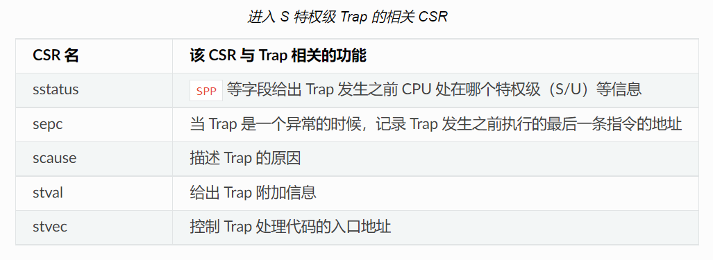

# chap 2 批处理系统

- [内容简述与补充](#内容简述与补充)
  - [特权机制](#特权机制)
  - [系统调用](#系统调用)
  - [如何实现用户进程](#如何实现用户进程)
  - [特权级转换](#特权级转换)
- [实现细节](#实现细节)
  - [实现用户程序](#实现用户程序)
  - [内核装入用户程序](#内核装入用户程序)
  - [实验题1: 实现调用栈展开内核程序](#实验题1-实现调用栈展开内核程序)

## 内容简述与补充

### 特权机制

- risc-v 五级特权：U/S/H/M，H 标准仍在制定 此处不涉及
- 特权是 **针对指令** 的：某些 （汇编）指令 是仅在某种特权级下才允许执行
- 特权级之间的切换接口：XBI（ABI、SBI）、API
  - 用来跳转的 **机器指令** : `ecal` `eret`
  - 运行在 M 模式上的软件被称为 监督模式执行环境 (SEE, Supervisor Execution Environment)
  - 监督模式二进制接口 (Supervisor Binary Interface, SBI): M 和 S 之间
  - 应用程序二进制接口 (Application Binary Interface, ABI): M 和 U 之间. 又叫 **系统调用**
- 补充: interrupts, exceptions 和 trap
  - [参考: RISC-V Manual](https://five-embeddev.com/riscv-isa-manual/latest/intro.html#sec:trap-defn)
  - interrupts: 外部的异步事件 (external asynchronous event)
  - exception: 对于当前 硬件线程 (hart) 正在执行的指令 (instruction) 发生的意外情况
  - trap: 由 interrupts 或 exceptions 引发的控制权向 trap handler 的转移. 描述从软件 **上层到底层** 的过程
  - hart: hardware threads 的缩写. [reference](https://stackoverflow.com/questions/42676827/risc-v-spec-references-the-word-hart-what-does-hart-mean)
- 是利用 **硬件 (CPU)实现的**
- 相关寄存器
  - `x0 ~ x31` 与特权级无关, 任何特权级都可以使用
  - 状态与控制寄存器(CSR)
    - [RISC-V CSR List](https://five-embeddev.com/quickref/csrs.html). 不同状态下允许访问不同的 CSR
    - 用于保存 S 级中断信息的寄存器, 属于CSR.

      

      其中 `SPP` 是 `sstatus` 的一个字段, 表示中断时的特权级, 参考 [risc-v manual: sstatus](https://five-embeddev.com/riscv-isa-manual/latest/supervisor.html#sstatus)

    > RISC-V 中包含 **M/H/S/U 四级中断信息寄存器**
    > 例如 `mstatus` `sstatus` `ustatus` `vstatus`
    > 其中 U 级(User-Level) 中断 在一般系统中不常见, 常用于只存在 M/U 状态的系统中 (完全禁用 M 级指令主要为了安全考虑?) 中断处理过程在 U 状态实现
    >
    > 在理解 U 级中断时, 要理解 指令集 (如 RISC-V) 与操作系统 (如 UNIX) 之间的上下层关系是分开的

    > 概念解释 **PSW** (程序状态字):
    > 参考: [牛津百科](https://www.encyclopedia.com/computing/dictionaries-thesauruses-pictures-and-press-releases/program-status-word) [维基百科](https://en.wikipedia.org/wiki/Program_status_word)  
    > 当前程序基本信息的集合. 通常存储在 Program State Register 中, 有时也可以存储在内存中
    > 通常包括:
    > - Program Counter (PC),
    > - ALU 计算信息 (如 进位, 溢出等),
    > - 特权级标志信息
    > - ......
    >
    > (这样说的话, PSW 应该包含 CSR?)

### 系统调用

- 系统调用 即 上述的 ABI. ABI 和 SBI 都是通过 `ecall` 指令进行调用(汇编代码), 而不是简单的函数调用. 因为 系统调用 是跟语言无关的
- ABI 和 SBI 调用规范 `ecall`:
  - `a0` 用来保存返回值, `a1~a6` 保存输入参数, `a7` 为 syscall ID, 表示哪一个 SBI(ABI) 被调用.

  ```rust
  // user/src/syscall.rs
  use core::arch::asm;
  fn syscall(id: usize, args: [usize; 3]) -> isize {
      let mut ret: isize;
      unsafe {
          asm!(
              "ecall",
              inlateout("x10") args[0] => ret,
              in("x11") args[1],
              in("x12") args[2],
              in("x17") id
          );
      }
      ret
  }
  ```

- 在内核端如何处理一个系统调用
  - 本质上是在处理一个 trap, 见下文

### 如何实现用户进程

- 主要回答两个问题:
  - 如何实现 **特权级的分割** , 如何实现 **系统调用** (ABI)
  - 如何安排用户程序的 **内存空间**
- 用户程序的 内存 安排
  - 首先, 每一个应用程序 (app) 分别编译生成机器码 (`.bin` 文件)
  - 当构建操作系统时, 将应用程序代码 (上述的 `.bin` 文件内容) 放在操作系统内存空间的数据段 (`.data` 段). **冯诺依曼计算机中代码即数据**
  - 操作系统启动后, 依次将 `.data` 段的程序代码一到代码段进行执行, 结束后清空, 并一如下一段程序.
    - 为什么是 `0x80400000`: [参考评论](https://rcore-os.github.io/rCore-Tutorial-Book-v3/chapter2/3batch-system.html), 这里为了简便, 二进制文件都是位置相关的, 这使得这些二进制代码当且仅当移动到其规定的正确绝对位置上才是可执行的.

### 特权级转换

- 陷入的过程是由 硬件 自主完成的. 类似 `ecall` 的伪指令, 包含了修改特权级相关寄存器的过程
  - `sstatus` 的 `SPP` 字段 将修改为 trap 之前的特权级 ([参考](https://five-embeddev.com/riscv-isa-manual/latest/supervisor.html#sstatus))
  - `sepc`: Supervisor Exception Program Counter, trap 之后 继续执行的指令地址
  - `scause` trap 原因代码, 判断是 系统调用, 缺页中断, 还是其他中断或异常等
  - `stval`: Supervisor Trap Value (stval) Register, trap 的补充信息
  - `stvec`: [Supervisor Trap Vector Base Address Register](https://five-embeddev.com/riscv-isa-manual/latest/supervisor.html#supervisor-trap-vector-base-address-register-stvec)
    - 在 [注释](https://rcore-os.github.io/rCore-Tutorial-Book-v3/chapter2/4trap-handling.html#trap-hw-mechanism) 中提到 这里 `MODE` 字段设为 Direct 模式, trap 处理地址为 `BASE<<2`. 因此下文中 trap 起始 `__alltraps` 处要使用 `.align 2` 对齐
    - 根据 [手册](https://five-embeddev.com/riscv-isa-manual/latest/supervisor.html#supervisor-trap-vector-base-address-register-stvec), Vectored 模式是在 `stvec` 下将 trap 分流. (可能由于是 异步的中断?)
  - `sscratch`: (这个不是 trap 发生时初始化的) 包含了 内核栈地址
    - `sscratch` 是内核代码中人为初始化的. 在 `batch::run_next_app` 中保存在 context 中的 `x[2]`, 并在 `__alltraps` 中读取到 `sscratch`
    - 根据 [手册](https://five-embeddev.com/riscv-isa-manual/latest/machine.html#machine-scratch-register-mscratch) `mscratch` 寄存器: Typically, it is used to hold a pointer to a machine-mode hart-local context space and swapped with a user register upon entry to an M-mode trap handler. 与此处类似
- 用户程序 和 内核程序 应当使用相互分离的内存空间
  - 使用全局变量 (`static`) 声明了连个 结构体 (`struct`) 指定内部空间各自为 8KiB. 因为是全局变量, 自动 (被 rust 编译器) 放在 `.bss` 段
  - 两个栈的基地址 在 `context::TrapContext::app_init_context` 处将及地址放入相应的寄存器

## 实现细节

### 实现用户程序

- Makefile 函数
  - `$(wildcard PATTERN...)` 匹配此模式的所有文件列表, 空格隔开
  - `$(patsubst <pattern>,<replacement>,<text>)` 在 `<text>` 中 匹配(查找) `<pattern>`, 匹配成功使用 `<replacement>` 替换
  - `$(foreach var,list,text)`: 循环. `list` 以空格隔开的列表, `list` 中的 `var` 再使用 `text` 计算得出结果. 例如:

    ```makefile
    files := aa bb cc
    outs := $(foreach f, $(files), $(f).o)
    ```

    则 `outs` 最终值为 `aa.o bb.o cc.o`
- 编译 [Package Layout](https://doc.rust-lang.org/cargo/guide/project-layout.html)
  - `main.rs` 是可执行入口, 对应的编译后将生成一个可执行文件
    - 若想要生成其他的可执行文件, 将带有 `main` 函数的 `*.rs` 放到 `bin`中
  - 用 `cargo build` 将 `bin/*rs` 生成为多个用户程序可执行文件

### 内核装入用户程序

- `build.rs`: 构建脚本([参考](https://rustwiki.org/en/rust-by-example/cargo/build_scripts.html)). 在 `cargo build` 时 自动 运行.

### 实验题1: 实现调用栈展开内核程序

- `asm!`: [文档](https://doc.rust-lang.org/core/arch/macro.asm.html), [rust by example](https://doc.rust-lang.org/nightly/rust-by-example/unsafe/asm.html#inputs-and-outputs)
- 中断/异常委托机制

