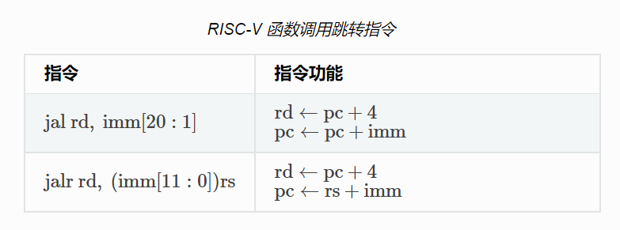

# chap 1 单进程系统

## 主要内容

正常 rust 程序建立在操作系统和 rust 标准库之上（标准库是基于操作系统的系统调用的）

因此包含以下工作

- 交叉编译: 将 编译目标 改为 RISC-V 裸机
  - 平台目标三元组:
    - `riscv64gc-unknown-none-elf`
    - 主要规定了 CPU 架构, CPU 厂商, 操作系统, 运行时库
- 编译时, 会在 std 检查 当前编译目标. 修改 编译目标 (target) 后, 可能找不到
  - `#![no_std]` 无需检查 std, 此时代码将连接到 `core` 而不是 `std`
  - 但 `core` 是特定于 硬件架构 的, 所以还需要加载 `riscv64gc-unknown-none-elf` 对应的 `core`
    - `rustup target add <target-triple>`
- 编译时, 需要首先检查

## 问题

- 链接脚本
  - `. = ALIGN(4K)` 当前地址 对齐到 4kb(?): [解释](https://stackoverflow.com/questions/8458084/align-in-linker-scripts)
  - 其他[格式说明](https://rcore-os.github.io/rCore-Tutorial-Book-v3/chapter1/4first-instruction-in-kernel2.html#id4)
  - 每段的前后 分别由变量 表明起始与结束. 如 `.text` 段 起始 `stext` 与结束 `etext`

  ```asm
    stext = .;
    .text : {
        *(.text.entry)
        *(.text .text.*)
    }

    . = ALIGN(4K);
    etext = .;
  ```

- `error[E0463]: can't find crate for core`
  - 当 更改 编译目标 (target) 之后, 显示的是 找不到 `std`:

    ```cmd
    error[E0463]: can't find crate for `std`
    ```

  - 当 添加 `#![no_std]` 之后, 显示的是 找不到 `core`
    - [reference](https://os.phil-opp.com/cross-compile-libcore/#:~:text=If%20you%20get%20an%20error%3A%20can%27t%20find%20crate,problem.%20For%20more%20details%2C%20see%20the%20rust-cross%20project.)
    - `core` 是 特定于 某个架构的, 所以 在交叉编译时 找不到 `core` 是指 找不到符合编译目标架构的 `core` 使用 `rustup target add <target-triple>` 即可
    - rustup 是 rust 安装器, 可用于 rust 语言版本, 编译目标等的切换. [rustup cross-compilation](https://rust-lang.github.io/rustup/cross-compilation.html#cross-compilation)

- 函数调用的系统实现
  - 如何实现函数的跳转
    - 两个 伪指令.
      
      通常使用 `ra` 作为上图中的 `rd`. (用于保存函数返回后的下一条指令地址)
    - 当函数再调用其他函数时(嵌套调用), `ra` 的值将会覆盖并永久丢失.
  - 如何保证某些寄存器调用前后保持不变
    - 调用前压入栈, 调用后恢复
    - **被调用者保存(Callee-Saved)寄存器** 和 **调用者保存(Caller-Saved)寄存器**
      - :warning: 不要被字面意思误导: **Caller**-Saved register 指的是 Callee 可以修改(但之后要恢复)的寄存器 (考虑 `ra`)
      - 函数入参 `x10~x17`: 调用者保存
        - **只有 8 个?** C语言规范中, 函数参数保存在 通用寄存器 `a0~a7` 中. 当参数个数超过 8 个时, 压入栈中. 因此不推荐超过 8 个参数. [参考](https://www.cnblogs.com/northeast-coder/p/15851692.html)
      - 栈顶指针 `sp`, 当前栈帧底指针 `fp`: 被调用者保存.
        
      - `ra` : 调用者保存寄存器. 但仅在每个 **调用者函数** 起始保存一次, 返回前再恢复.
- 系统调用 rustsbi 实现原理
  - 对于 操作系统内核 之下的服务层 [参见评论](https://rcore-os.github.io/rCore-Tutorial-Book-v3/appendix-c/index.html)
